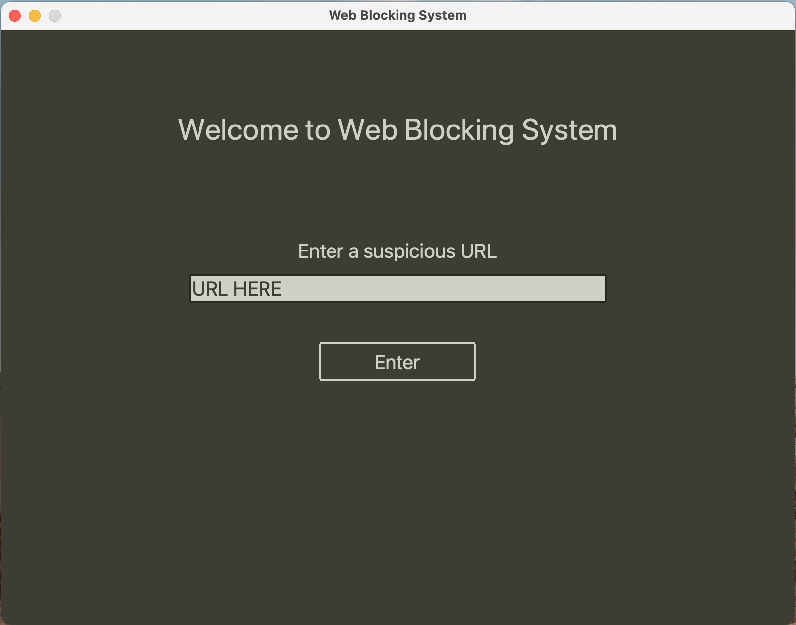
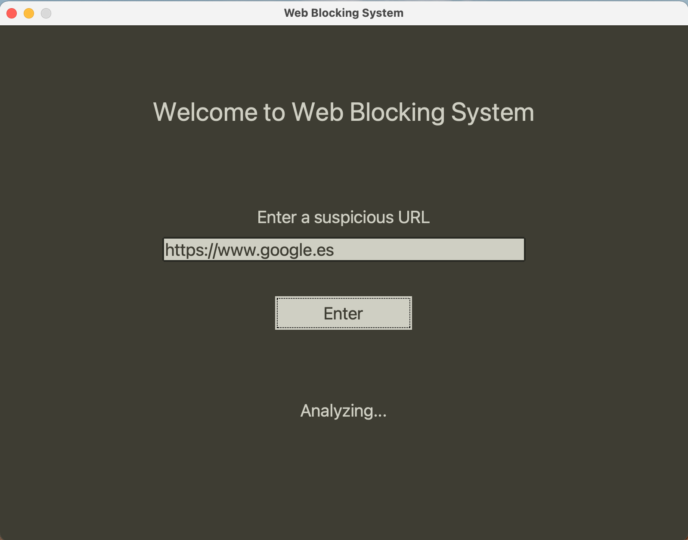
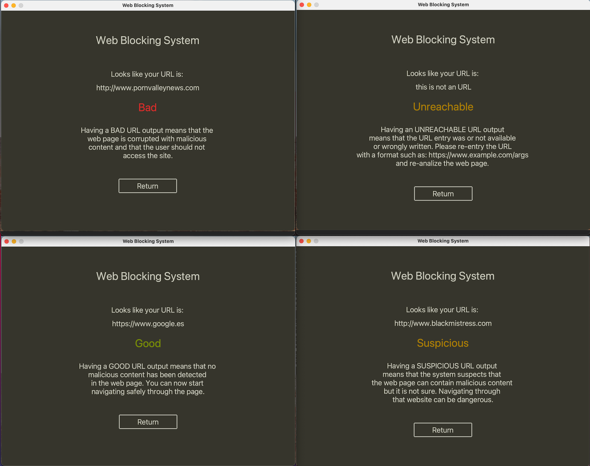

# WBSInterface

The main interface for the Webpages Blocking System repository

## Structure

Main view


Data analysis entering view


Output view



## Execution commands 

To download all the needed libraries execute the following command in the bash console

```bash
pip install -r requirements.txt
```

To execute the project introduce the following command in the bash console.

```bash
python -m Demo
```
